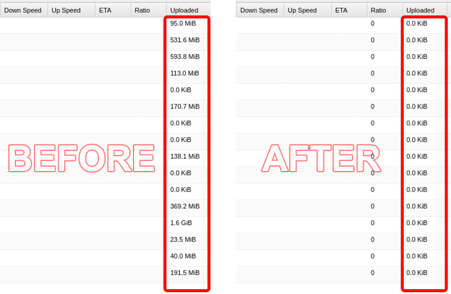

# Deluge Upload Resetter



A Python script to reset the uploaded amount in Deluge.

## Features

- Automatically detects and resets uploaded amounts in `torrents.fastresume`
- Option to prompt for confirmation before resetting each torrent
- Creates automatic backups before modifications
- Simple command-line interface

## Prerequisites

- Python 3.8 or higher (tested on Python 3.12)

**Linux users:** Install venv support first:
```bash
sudo apt install python3-venv
```

## Installation

### Option 1: With virtual environment (recommended)
```bash
# Clone the repository
git clone https://github.com/MadMan2k/deluge-upload-resetter.git
cd deluge-upload-resetter

# Create virtual environment
python3 -m venv .venv

# Activate virtual environment
source .venv/bin/activate  # On Windows: .venv\Scripts\activate

# Install dependencies
pip install -r requirements.txt
```

**Note:** When using a virtual environment, you must activate it each time before running the script:
```bash
source .venv/bin/activate  # On Windows: .venv\Scripts\activate
```
You'll see `(.venv)` in your terminal prompt when the virtual environment is active.

To deactivate the virtual environment when done:
```bash
deactivate
```

### Option 2: Without virtual environment
```bash
# Clone the repository
git clone https://github.com/MadMan2k/deluge-upload-resetter.git
cd deluge-upload-resetter

# Install dependencies
pip install -r requirements.txt
```

## Usage
```bash
python deluge-upload-resetter.py [options]
```

**If using virtual environment (Option 1), remember to activate it first:**
```bash
source .venv/bin/activate  # On Windows: .venv\Scripts\activate
python deluge-upload-resetter.py [options]
```

## Options

| Short Option | Long Option   | Description                                                                          |
|--------------|---------------|--------------------------------------------------------------------------------------|
| -p `<path>`  | --path `<path>`| Specify the path to directory containing torrents.fastresume. If not specified, uses current directory.|
| -s           | --single      | Prompt for confirmation before resetting the uploaded amount for each torrent.       |
| -h           | --help        | Display the help message.                                                            |

## Examples

### Reset uploads in current directory
```bash
python deluge-upload-resetter.py
```

### Specify path to Deluge state directory (contains torrents.fastresume inside)
```bash
python deluge-upload-resetter.py -p /path/to/deluge/state
```

### With confirmation for each torrent
```bash
python deluge-upload-resetter.py -p /path/to/deluge/state -s
```

## Example Output
```yaml
Using file: /path/to/deluge/state/torrents.fastresume
Single file mode enabled

Torrent: Ubuntu 22.04 LTS
  Current uploaded: 2.45 GB
  Reset uploaded amount? (y/n): y

Torrent: Debian 12 ISO
  Current uploaded: 1.23 GB
  Reset uploaded amount? (y/n): y

Backup created: /path/to/deluge/state/torrents.fastresume.deluge-upload-resetter.bak

Uploaded amount reset successfully for the following torrents:
1. Ubuntu 22.04 LTS
2. Debian 12 ISO
```

## Backup and Recovery

### Automatic Backup
The script automatically creates a backup file before making any changes:
```
torrents.fastresume.deluge-upload-resetter.bak
```

**Important notes about backups:**
- This backup file is created by **this script**, not by Deluge
- Deluge may have its own `torrents.fastresume.bak` file, which is unrelated to this tool
- The backup is **overwritten** each time the script makes changes (if no changes are made, the backup is not touched)
- The backup is **not deleted** automatically

### How to Restore from Backup

If you need to restore the original uploaded amounts:
```bash
# Navigate to your Deluge state directory
cd /path/to/deluge/state

# Stop Deluge first
# Then restore the backup:
cp torrents.fastresume.deluge-upload-resetter.bak torrents.fastresume

# Restart Deluge
```

## Notes

- **Always stop Deluge** before running the script to avoid conflicts
- The script only modifies the `total_uploaded` field in `torrents.fastresume`
- A backup is created/overwritten automatically when changes are made

## License

This project is licensed under the MIT License. See the [LICENSE](LICENSE) file for details.
```